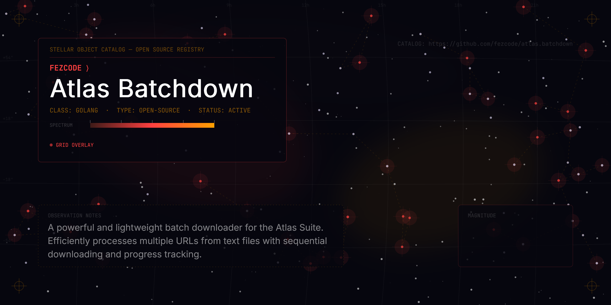

# atlas.batchdown



A simple batch downloader for the Atlas Suite. It reads a list of URLs from a `.txt` file and downloads them sequentially.

## Installation

### Prerequisites
- [gobake](https://github.com/fezcode/gobake)
- Go 1.22+

### Build from source
```bash
gobake build
```

## Usage
Create a text file with one URL per line:
```text
https://example.com/video1.mp4
https://example.com/image.png
```

Run the tool:
```bash
./build/atlas.batchdown links.txt
```

## Flags
- `-v, --version`: Show version information.
- `-h, --help`: Show help information.

## License
MIT
